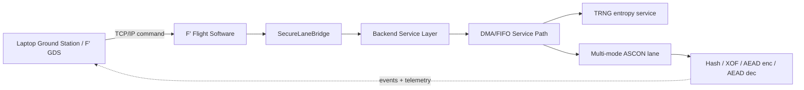
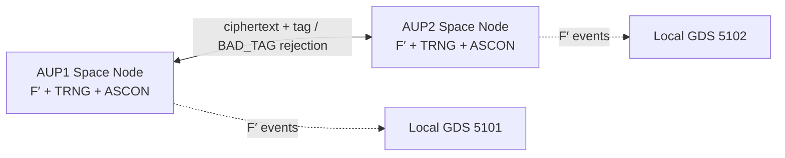
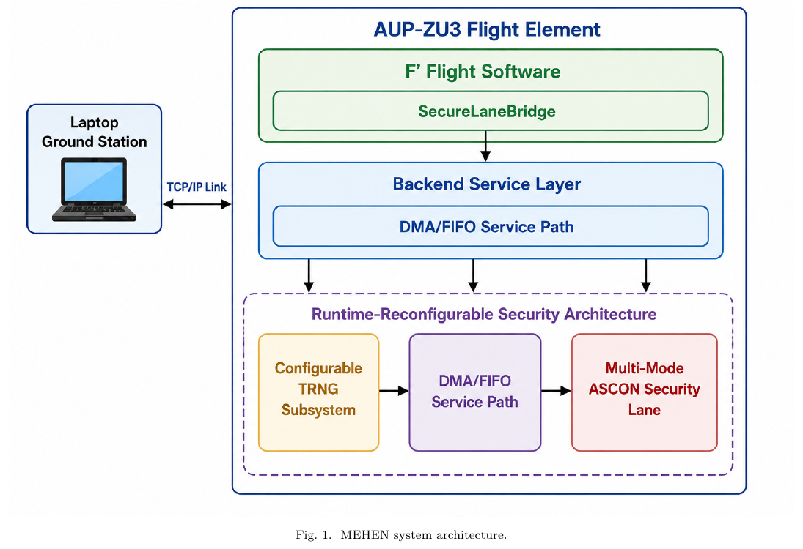
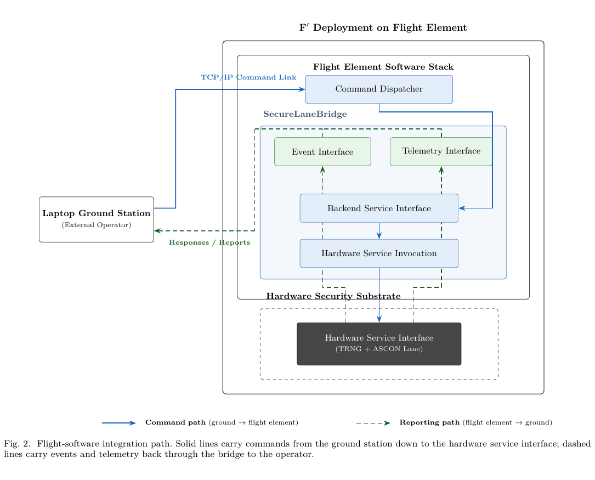
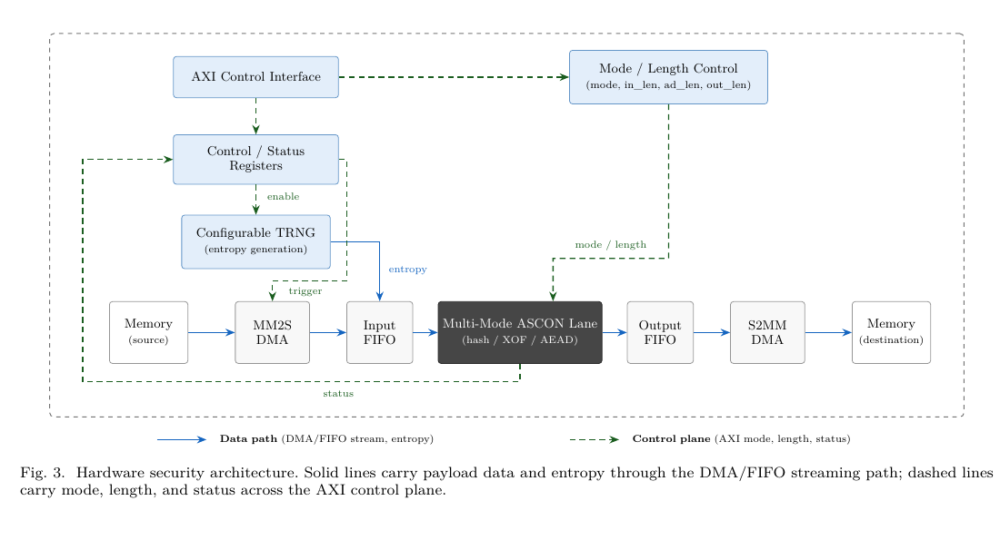
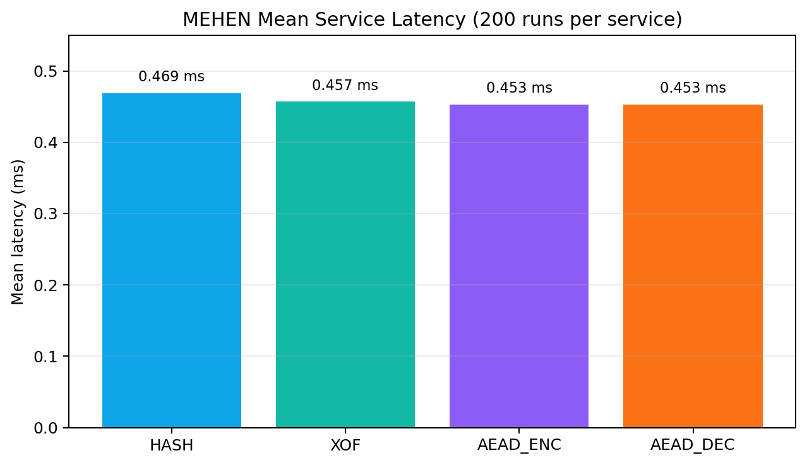
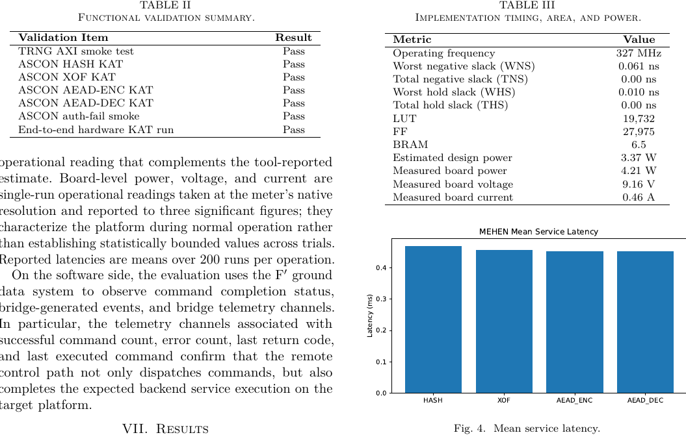
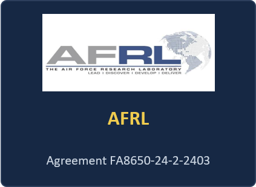
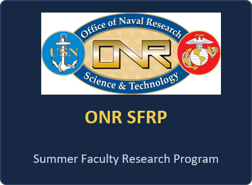
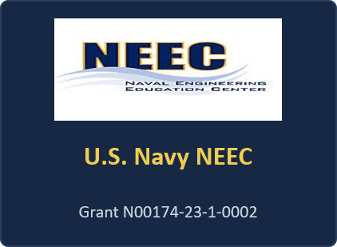

<div align="center">
  

# MEHEN Secure Space-Link

### F′-Visible TRNG + ASCON Secure Services on AUP-ZU3

[](#hardware-requirements)
[](#fprime-command--event-map)
[](#why-ascon)
[](#what-this-repository-demonstrates)
[](#live-demo-flow)

**MEHEN turns a TRNG + multi-mode ASCON hardware lane into a commandable, observable flight-software service and visualizes a two-node secure space-link demonstration.**

</div>

---

## What this repository demonstrates

MEHEN is a runtime-reconfigurable hardware-security architecture for space-flight software. It integrates:

- a board-resident **TRNG entropy service**,
- a **multi-mode ASCON lane** for hash, XOF, AEAD encryption, and AEAD decryption,
- a DMA/FIFO-backed service path,
- an F′ `SecureLaneBridge` command/event interface,
- and a Windows mission-control dashboard for a **two-AUP secure-link demonstration**.

The repository is organized around a live demo: AUP1 and AUP2 run F′/MEHEN stacks, expose F′ events, exchange protected packets through a demo link agent, and visibly reject a tampered packet with `BAD_TAG`.

> Honest scope: the published MEHEN paper demonstrates the single AUP-ZU3 flight-software-visible service path. The two-AUP dashboard extends that service into a visual secure-link demonstration for presentation and integration testing.

---

## Architecture



### Two-AUP demonstration path



---

## Why ASCON

ASCON maps naturally to a single runtime-selectable lane:

| Service | Shared ASCON behavior | MEHEN role |
|---|---|---|
| Hash | absorb message, squeeze digest | `HASH_TEST` |
| XOF | absorb message, squeeze variable output | `XOF_TEST` |
| AEAD encrypt | absorb AD/plaintext, output ciphertext + tag | link/demo + `ROUNDTRIP` |
| AEAD decrypt | verify tag before accepting plaintext | link/demo + tamper rejection |

MEHEN changes mode and length controls. It does **not** require partial FPGA reconfiguration or four replicated datapaths.

---

## F′ command / event map

| F′ command | Service meaning | Expected F′ event |
|---|---|---|
| `SecureLane.secureLaneBridge.GET_KEY128` | TRNG-backed key material | `Key128Ready` |
| `SecureLane.secureLaneBridge.HASH_TEST` | ASCON hash service | `HashOk` |
| `SecureLane.secureLaneBridge.XOF_TEST` | ASCON XOF service | `XofOk` |
| `SecureLane.secureLaneBridge.ROUNDTRIP` | AEAD encrypt/decrypt/tag verification | `RoundTripOk` |

---

## Live demo flow

Operator flow in the dashboard:

1. **RESET + OPEN F-PRIME**  
   Cleans both AUPs, starts both F′ stacks, opens GDS windows.

2. **CHECK + PRIME F-PRIME**  
   Runs board proof: overlay, TRNG, ASCON KATs, benchmark, and safe F′ events.

3. **ESTABLISH SECURE CHANNEL**  
   Starts/refreshes link receivers and generates a session probe.

4. **SEND AUP1 TO AUP2**  
   Shows ciphertext + tag movement and verification.

5. **SEND AUP2 TO AUP1**  
   Shows reverse secure reply.

6. **TAMPER TEST**  
   Flips protected data/AAD and confirms `BAD_TAG` rejection.

7. **RUN FULL DEMO**  
   Runs session + bidirectional packets + tamper rejection.

8. **OPTIONAL F-PRIME EVENT SET**  
   Issues `GET_KEY128`, `HASH_TEST`, `XOF_TEST`, and `ROUNDTRIP` to both AUP GDS instances.

---

## Quick start

### Windows host

Open PowerShell from:

```powershell
cd dashboard/windows
.\RUN_MEHEN_MISSION_CONTROL.bat
```

The dashboard expects:

| Node | SSH user | Address | GDS tunnel |
|---|---:|---:|---:|
| AUP1 | `xilinx` | `100.116.148.59` | `http://127.0.0.1:5101/` |
| AUP2 | `xilinx` | `100.71.108.15` | `http://127.0.0.1:5102/` |

### AUP-side expected project path

```bash
~/spaccomputing
~/spaccomputing/SecureLane
```

---

## Dashboard package

The current Windows mission-control package is stored at:

```text
dashboard/windows/
```

Main entry point:

```text
dashboard/windows/RUN_MEHEN_MISSION_CONTROL.bat
```

Key files:

| File | Purpose |
|---|---|
| `MEHEN_Mission_Control.ps1` | Main WinForms dashboard |
| `START_AUP1_FPRIME.ps1` | Launch AUP1 F′ stack/watchdog |
| `START_AUP2_FPRIME.ps1` | Launch AUP2 F′ stack/watchdog |
| `OPEN_BOTH_FPRIME_GUIS.ps1` | GDS tunnel/browser helper |
| `RUN_MEHEN_LINK_ACTION.ps1` | Secure-link action runner |
| `mehen_secure_link_agent.py` | Two-node demo link agent |
| `mehen_remote_control.sh` | Board-side MEHEN service checker |
| `fprime_watchdog_remote.sh` | Remote F′ app/GDS watchdog |

---

## Evidence expected during demo

### Board/service proof

The dashboard should report:

```text
OVERLAY=PASS
TRNG=PASS
ASCON_KAT=PASS
BENCH=PASS
SERVICE_CHECK=PASS
```

### F′ event proof

The F′ event panes should show:

```text
Key128Ready
HashOk
XofOk
RoundTripOk
```

### Secure-link proof

The dashboard event rail should show:

```text
TRNG_SESSION_READY
AEAD_ENCRYPT_DONE
AEAD_DECRYPT_VERIFY_PASS
AEAD_DECRYPT_VERIFY_BAD_TAG_REJECT
```

---

## Known limitations and honest boundaries

- The MEHEN paper result is a single AUP-ZU3 flight-software-visible security service.
- The two-AUP dashboard is a presentation/integration extension around that service.
- The TRNG evidence in this repository is board-level smoke testing, not a full NIST SP 800-90B entropy-source assessment.
- The demo link agent visualizes protected packet exchange and tag rejection; the F′ component path is separately exercised through `SecureLaneBridge` commands and events.
- Full mission deployment would require additional authentication, operational hardening, and sustained-load testing.

---

## Citation

```bibtex
@inproceedings{elhadedy2026mehen,
  title        = {MEHEN: A Runtime-Reconfigurable Security Architecture for Space Flight Software},
  author       = {El-Hadedy, Mohamed},
  booktitle    = {IEEE SMC-IT/SCC 2026},
  year         = {2026},
  note         = {Space Computing, Pasadena, CA}
}
```

---

## Acknowledgments

This work is gratefully supported by:

- **U.S. Navy Naval Engineering Education Center (NEEC)**
- **ONR Summer Faculty Research Program (SFRP)**
- **Air Force Research Laboratory (AFRL)**
- **U.S. Department of Defense**
- **AMD Adaptive Computing** as platform partner through the AUP-ZU3 platform

The views and conclusions are those of the author and do not necessarily represent the official policies or endorsements of the sponsors.

---

<div align="center">

**MEHEN: make hardware security commandable, observable, and flight-software visible.**

</div>

<!-- MEHEN README ENHANCEMENT START -->

<p align="center">
  
  
  
  
  
</p>

## Paper-backed Results at a Glance

MEHEN is a runtime-reconfigurable security architecture for space flight software. It integrates a board-resident TRNG with a multi-mode ASCON cryptographic lane and exposes the combined service through F Prime command, event, and telemetry mechanisms.

<table>
  <tr>
    <th align="left">Layer</th>
    <th align="left">What MEHEN provides</th>
    <th align="left">Repository evidence</th>
  </tr>
  <tr>
    <td><b>Hardware security</b></td>
    <td>TRNG + multi-mode ASCON lane over a unified DMA/FIFO service path</td>
    <td><code>hardware/hls/</code>, <code>hardware/overlays/</code></td>
  </tr>
  <tr>
    <td><b>Flight software</b></td>
    <td>F Prime SecureLaneBridge commands for entropy, HASH, XOF, and AEAD round-trip service checks</td>
    <td><code>flight-software/fprime/SecureLane/</code></td>
  </tr>
  <tr>
    <td><b>Board validation</b></td>
    <td>TRNG smoke test, ASCON KATs, hardware benchmark scripts, and AUP-ZU3 overlay artifacts</td>
    <td><code>software/board-tests/</code>, <code>software/kat/</code>, <code>software/benchmarks/</code></td>
  </tr>
  <tr>
    <td><b>Operator demo</b></td>
    <td>Two-AUP secure space-link mission-control dashboard with pass/reject visualization</td>
    <td><code>dashboard/windows/</code>, <code>evidence/</code></td>
  </tr>
</table>

## Architecture Figures

### Fig. 1. End-to-end MEHEN system architecture

<p align="center">
  
</p>

The flight element exposes the SecureLaneBridge above a backend service layer. Below it, the runtime-reconfigurable security architecture combines the configurable TRNG subsystem, DMA/FIFO service path, and multi-mode ASCON lane.

### Fig. 2. F Prime integration path

<p align="center">
  
</p>

Commands flow from the laptop ground station through the F Prime deployment into the SecureLaneBridge and hardware service interface. Events and telemetry report status back to the operator.

### Fig. 3. Hardware service path

<p align="center">
  
</p>

The hardware path uses AXI control/status registers for TRNG enable, mode selection, length control, and status. Data moves through MM2S DMA, input FIFO, the multi-mode ASCON lane, output FIFO, and S2MM DMA.

## SecureLaneBridge Command Map

| F Prime command | Hardware-backed service | Expected event / result |
|---|---|---|
| `GET_KEY128` | TRNG-backed 128-bit key material | `Key128Ready` |
| `HASH_TEST` | ASCON hash service | `HashOk` |
| `XOF_TEST` | ASCON XOF service | `XofOk` |
| `ROUNDTRIP` | AEAD encrypt/decrypt validation | `RoundTripOk` |

The bridge is intentionally narrow: it exposes fixed services, not raw register access.

## Functional Validation Summary

| Validation item | Result |
|---|---:|
| TRNG AXI smoke test | PASS |
| ASCON HASH KAT | PASS |
| ASCON XOF KAT | PASS |
| ASCON AEAD-ENC KAT | PASS |
| ASCON AEAD-DEC KAT | PASS |
| ASCON auth-fail smoke | PASS |
| End-to-end hardware KAT run | PASS |

## Implementation Snapshot

| Metric | Value |
|---|---:|
| Operating frequency | 327 MHz |
| Worst negative slack (WNS) | 0.061 ns |
| Total negative slack (TNS) | 0.00 ns |
| Worst hold slack (WHS) | 0.010 ns |
| Total hold slack (THS) | 0.00 ns |
| LUT | 19,732 |
| FF | 27,975 |
| BRAM | 6.5 |
| Estimated design power | 3.37 W |
| Measured board power | 4.21 W |
| Measured board voltage | 9.16 V |
| Measured board current | 0.46 A |

## Mean Service Latency

<p align="center">
  
</p>

| Service | Mean latency |
|---|---:|
| HASH | 0.469 ms |
| XOF | 0.457 ms |
| AEAD encrypt | 0.453 ms |
| AEAD decrypt | 0.453 ms |

## F Prime Integration Results

| Integration item | Result |
|---|---:|
| F Prime deployment on board | PASS |
| Laptop GDS TCP connection | PASS |
| SecureLaneBridge command registration | PASS |
| `GET_KEY128` remote execution | PASS |
| `HASH_TEST` remote execution | PASS |
| `ROUNDTRIP` remote execution | PASS |
| Bridge telemetry update | PASS |
| Bridge error path during shown runs | PASS |

## Prototype Boundaries

> MEHEN is a working prototype and research artifact, not a mission-qualified crypto subsystem. The current implementation uses one integrated TRNG-ASCON lane, reports board-level TRNG smoke testing rather than a full SP 800-90B entropy assessment, and emits decrypted stream output before tag verification fully resolves. Downstream software must gate use of decrypted output on the authentication status path.

## Results Snapshot

<p align="center">
  
</p>

## Acknowledgments and Sponsor Support

This work was supported by the U.S. Navy Naval Engineering Education Center (NEEC), the Office of Naval Research Summer Faculty Research Program (SFRP), the U.S. Department of Defense under award `W911NF-24-1-0265`, and the Air Force Research Laboratory (AFRL) under agreement `FA8650-24-2-2403`.

The views and conclusions contained here are those of the author and should not be interpreted as necessarily representing the official policies or endorsements, either expressed or implied, of AFRL or the U.S. Government.

Sponsor logo files may be placed under `assets/logos/` using filenames such as `navy.png`, `onr.png`, `afrl.png`, `dod.png`, and `amd.png`. Use only logos or brand assets that are permitted for public repository use.

<!-- MEHEN README ENHANCEMENT END -->

<!-- MEHEN-SPONSORS-START -->

## Sponsors and Acknowledgments

<p align="center">
  
  
</p>
<p align="center">
  
  
</p>

This work was supported by the U.S. Navy Naval Engineering Education Center (NEEC), the Office of Naval Research Summer Faculty Research Program (ONR SFRP), the U.S. Department of Defense under award **W911NF-24-1-0265**, and the Air Force Research Laboratory (AFRL) under agreement **FA8650-24-2-2403**.

The views and conclusions are those of the author and should not be interpreted as necessarily representing the official policies or endorsements, either expressed or implied, of AFRL or the U.S. Government.

<!-- MEHEN-SPONSORS-END -->
